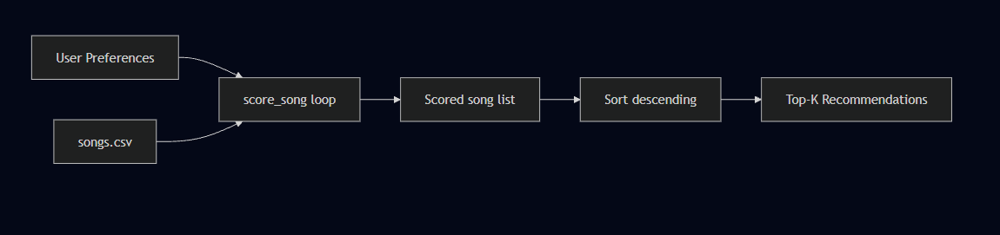
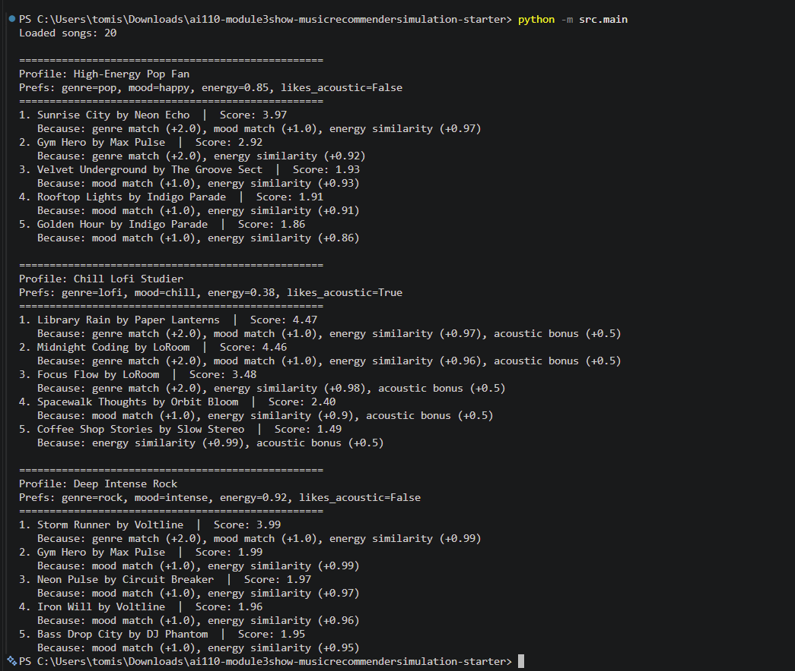

# 🎵 Music Recommender Simulation

## Project Summary

VibeCheck 1.0 is a content-based music recommender that scores every song in a 20-song catalog against a user's taste profile and returns the top 5 matches with plain-language explanations. Each song is scored on genre match, mood match, energy proximity, and an optional acoustic preference bonus. The system is designed for classroom exploration — not production use — and demonstrates how simple weighted rules can produce surprisingly intuitive (and sometimes surprising) recommendations.

---

## How The System Works

### Real-World Context

Platforms like Spotify use two main approaches: **collaborative filtering** (recommending songs that users with similar listening histories enjoyed) and **content-based filtering** (recommending songs whose audio features match what you already like). VibeCheck 1.0 is purely content-based — it never looks at what other users do.

### Features Used

Each `Song` in the catalog has:

- `genre` — categorical (pop, rock, lofi, edm, etc.)
- `mood` — categorical (happy, chill, intense, sad, etc.)
- `energy` — float 0.0–1.0 (how energetic the track feels)
- `acousticness` — float 0.0–1.0 (how acoustic vs. electronic)
- `tempo_bpm`, `valence`, `danceability` — present in the CSV but not used in scoring (future work)

Each `UserProfile` stores:

- `favorite_genre`, `favorite_mood` — categorical preferences
- `target_energy` — the energy level the user wants
- `likes_acoustic` — boolean flag for acoustic preference

### Algorithm

```
score = 0

if song.genre == user.favorite_genre  →  +2.0  (genre match)
if song.mood  == user.favorite_mood   →  +1.0  (mood match)
energy_score = 1.0 - |song.energy - user.target_energy|  →  +0.0 to +1.0
if user.likes_acoustic and song.acousticness >= 0.7  →  +0.5  (acoustic bonus)
```

Songs are then sorted by score descending and the top `k` are returned.

### Data Flow



---

## Getting Started

### Setup

1. Create a virtual environment (optional but recommended):

   ```bash
   python -m venv .venv
   source .venv/bin/activate      # Mac or Linux
   .venv\Scripts\activate         # Windows

   ```

2. Install dependencies

```bash
pip install -r requirements.txt
```

3. Run the app:

```bash
python -m src.main
```

### Running Tests

Run the starter tests with:

```bash
pytest
```

You can add more tests in `tests/test_recommender.py`.

---

## Experiments You Tried

### Profile 1

`genre=pop, mood=happy, energy=0.85`

Top result: **Sunrise City** (Score: 3.97) — perfect genre + mood + energy match. **Gym Hero** ranked 2nd despite being "intense" mood, because the genre match alone gave it 2 points. This showed that genre weight can override mood mismatches.

### Profile 2

`genre=lofi, mood=chill, energy=0.38, likes_acoustic=True`

Top results were all lofi tracks with high acousticness. Results felt the most accurate of all three profiles — the combination of genre + mood + acoustic bonus created a strong, consistent signal.

### Profile 3

`genre=rock, mood=intense, energy=0.92`

Only one rock song exists (Storm Runner, Score: 3.99). Ranks 2–5 were filled by EDM and metal songs that matched on mood and energy but not genre. This clearly exposed the small-catalog limitation.

Halving the genre weight from 2.0 to 1.0 would cause energy similarity to dominate, mixing genres together based purely on tempo feel. The lofi profile would likely surface ambient and acoustic songs from other genres — less accurate but more diverse.

## 

---

## Limitations and Risks

- Only 20 songs — niche genre users run out of good matches quickly
- No collaborative filtering — ignores what similar users enjoy
- Genre weight can suppress good mood/energy matches from other genres
- Missing features: tempo preference, lyrics, language, listening history
- Dataset skews toward Western English-language genres

---

## Reflection

Read and complete `model_card.md`:

[**Model Card**](model_card.md)

Building this system made it clear that a recommender's "intelligence" lives almost entirely in the weights you assign, not in any deep understanding of music. Changing genre weight from 2.0 to 0.5 would completely change the output even though no song data changed. The gap between "mathematically correct" and "feels right" is exactly where real platforms invest enormous engineering effort, using listening history, neural embeddings, and collaborative signals to close it. This project made me much more thoughtful about what any recommendation algorithm is actually optimizing for, and whose taste its training data reflects.
